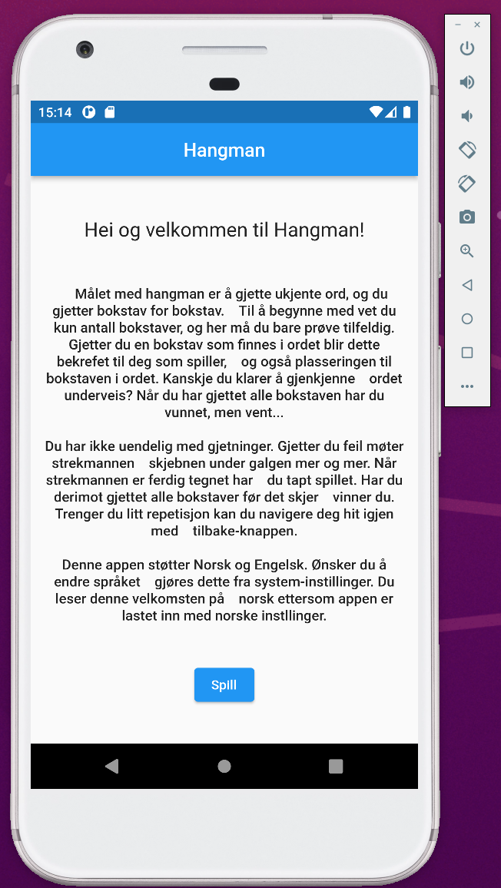
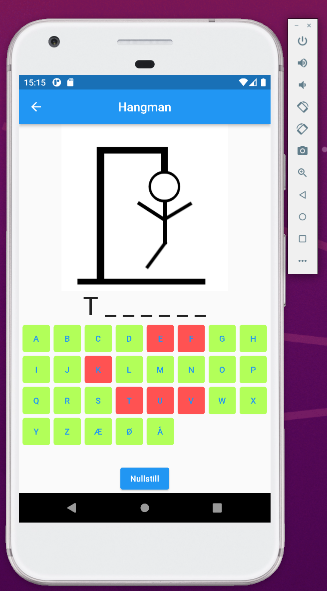
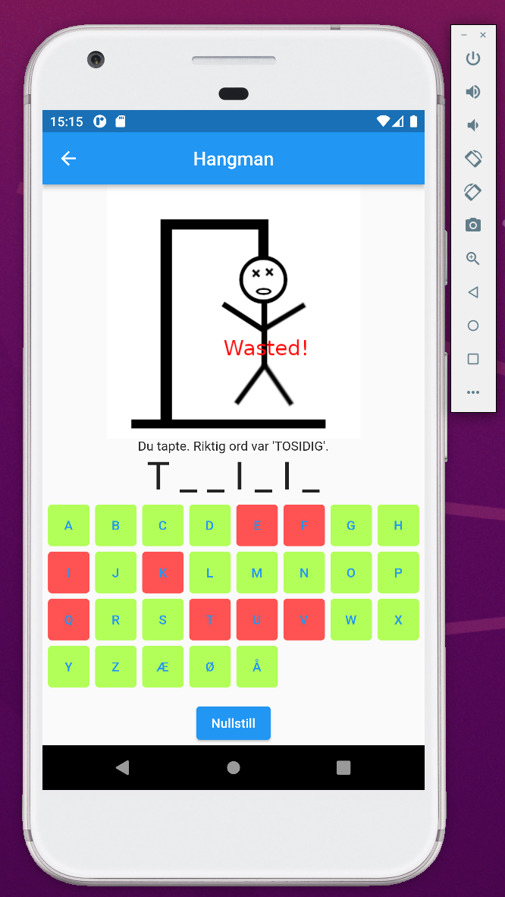
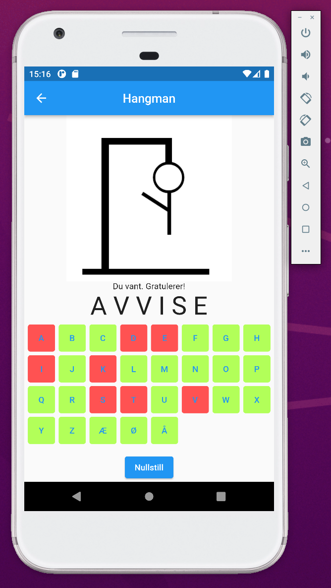

# Hangman - INFT2501

## Development tools

During testing, this program were executed on a emulator with the following specs:

Device-type: Pixel XL
Android version: 11.0 (R) - API 30
Emulator version: 31.1.3-7904455

## Run instructions

1. Install Android studio by Jetbrains.
2. Install Flutter plugin in Android studio.
3. In the device selector in the top right menu, select an Android emulator for running the app.
If none are currently installed, open 'AVD manager' via the tool dropdown menu, and install
   one from here. Remember to select the device after installation.
4. Open the file 'main.dart', and compile/run the source-code by clicking green-arrow on the left.

## Screenshots

**game-tutorial**

**mid-game**

**game-lost**

**game-won**

